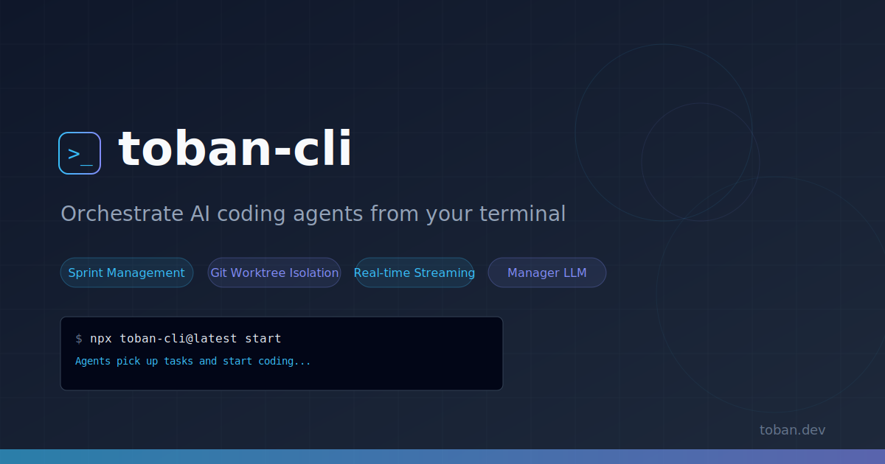

<p align="center">
  
</p>

<p align="center">
  <a href="https://www.npmjs.com/package/toban-cli"></a>
  <a href="https://www.npmjs.com/package/toban-cli"></a>
  <a href="https://opensource.org/licenses/MIT"></a>
  <a href="https://nodejs.org/">= 20"></a>
</p>

# toban-cli

Orchestrate AI coding agents from your terminal. Toban CLI connects to your [Toban](https://toban.dev) workspace, fetches sprint tasks, and runs Claude Code agents in isolated git worktrees -- fully automated.

## Quick Start

```bash
# 1. Install Claude Code CLI (the agent engine)
npm install -g @anthropic-ai/claude-code

# 2. Run from the Sprint page -- click "$ run" to copy the command
npx toban-cli@latest start --api-url <URL> --api-key <KEY>

# 3. Agents pick up tasks and start coding
```

No global install needed. `npx` downloads and runs the latest version.

## What It Does

```
You (PM)          Toban Dashboard          toban-cli              Agents
  |                    |                      |                     |
  |  Create sprint     |                      |                     |
  +------------------->|                      |                     |
  |                    |   Fetch tasks        |                     |
  |                    |<---------------------+                     |
  |                    |                      |  Spawn in worktree  |
  |                    |                      +-------------------->|
  |                    |    Stream activity    |                     |
  |                    |<---------------------+<--------------------+
  |  Review & approve  |                      |                     |
  |<-------------------+                      |   Merge & push      |
  |                    |                      +-------------------->|
```

- **Sprint-driven**: Connects to the Toban API and executes tasks from the current sprint
- **Isolated execution**: Each agent runs in its own git worktree -- no conflicts between parallel tasks
- **Real-time streaming**: Agent activity (tool use, file edits, commands) streams to the dashboard live
- **Auto merge & push**: Completed branches are merged to main and pushed automatically
- **Code review**: Automated reviewer checks every change before merge

## Requirements

- **Node.js 20+**
- **[Claude Code CLI](https://docs.anthropic.com/en/docs/claude-code)** installed globally
- A Toban workspace with an API key (get one at [toban.dev](https://toban.dev))

## Usage

```bash
# Using command-line flags
npx toban-cli@latest start --api-url https://api.toban.dev --api-key tb_...

# Using environment variables
export TOBAN_API_URL=https://api.toban.dev
export TOBAN_API_KEY=tb_wsXXX_sk_XXX
npx toban-cli@latest start
```

## Options

| Flag | Env Variable | Description |
|------|-------------|-------------|
| `--api-url <url>` | `TOBAN_API_URL` | Toban API base URL |
| `--api-key <key>` | `TOBAN_API_KEY` | API key for authentication |
| `--working-dir <dir>` | | Repository root (default: cwd) |
| `--branch <branch>` | | Base branch (default: main) |
| `--engine <type>` | | Agent engine (default: claude) |
| `--ws-port <port>` | | WebSocket port (default: 4000, 0=auto) |
| `--debug` | `DEBUG=1` | Verbose output |

## How It Works

1. **Connect** -- CLI authenticates with the Toban API and polls for tasks
2. **Execute** -- Each task spawns a Builder agent in an isolated git worktree
3. **Stream** -- Activity streams to the dashboard via WebSocket in real-time
4. **Verify** -- Build and tests are verified after the agent commits
5. **Review** -- A Reviewer agent checks the diff for quality and correctness
6. **Merge** -- Approved changes are merged to main and pushed to the remote

## Supported Agent Engines

| Engine | Status | Description |
|--------|--------|-------------|
| Claude Code | Stable | Primary and recommended engine via `@anthropic-ai/claude-code` CLI |
| Codex CLI | Experimental | OpenAI Codex CLI integration |
| Gemini CLI | Experimental | Google Gemini CLI integration |

## Documentation

- [Getting Started](https://app.toban.dev/docs/getting-started) -- Full setup walkthrough
- [Architecture](https://app.toban.dev/docs/architecture) -- How Toban works under the hood
- [Security](https://app.toban.dev/docs/security) -- Security model and agent isolation

## License

MIT
